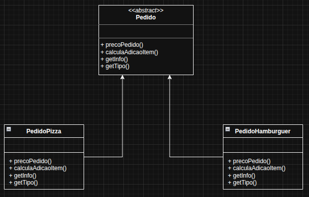

# Template Method

O Template Method é um padrão de projeto comportamental que define o passo a passo de um algoritmo em um método, mas permite que algumas etapas sejam sobrescritas pelas subclasses. Resumindo: ele cria um “modelo” de execução, e as subclasses completam ou personalizam partes específicas.

No exemplo, foi usado o padrão, na gerência de pedidos onde o cliente escolhe entre uma pizza ou hambúrguer e decide se adiciona mais itens ou não, tendo classes específicas para cada uma das opções e com um valor específico para cada um e com um valor fixo para cada adição no pedido.

